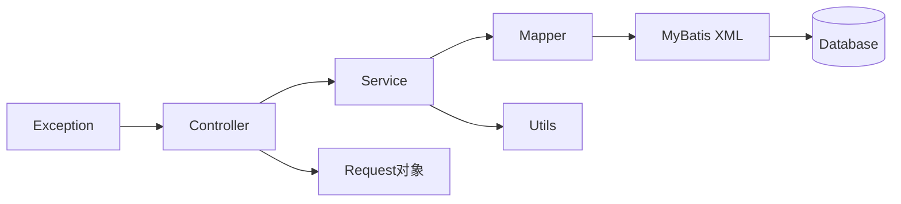

# 用户中心项目

> 本项目已上线，仓库代码为纯后端代码。
>
> 上线地址：[登录 - 平用户中心](https://user.qiutang.icu)
>
> > 管理员账号：ping 密码：12345678


## 项目介绍

基于spirng Boot + React 的一站式用户管理系统，实现了用户注册、登录、查询管理等功能。

1. 选用 MyBatis + MyBatis-Plus 进行数据访问层开发，使用MyBatis Plus + MyBatis X自动生成基础 CRUD 代码
2. 复用大多数通用方法，并且通过继承定制了自己的 **通用操作模版** ，大幅提升了项目开发效率。
3. 为了明确接口的返回，自定义统一的错误码，并封装了 **全局异常处理器** ，从而规范了异常返回、屏蔽了项目冗余的报错细节。
4. 使用 JUnit Jupiter API 的 @Test注解和`Assertions`类实现对用户模块的单元测试，测试覆盖度达到90%。
5. 通过 Spring Boot 的多套 application-{env}.yml 配置文件实现多环境，并通过指定 --spring.profiles.active=prod 实现生产环境部署。
6. 使用 Nginx 网关统一接受前端页面和后端接口请求，并通过其 proxy_pass 反向代理配置解决跨域问题。


## 技术选型

前端：基础三件套 + React + 组件库 Ant Design + Umi + Ant Design Pro

后端：

- java 
- spring （依赖注入框架，帮助你管理Java对象，集成一些其他的内容）
- springmvc （web框架，提供接口访问、restful接口等能力）
- mybatis  （Java操作数据库的框架，持久层框架，对jdbc的封装）
- mybatis-plus （对mybaits的增强，不用写sql也能实现增删改查）
- springboot （**快速启动** / 快速集成项目。不用自己管理spring配置，不用自己整合各种框架）
- mysql 
- junit 单元测试库


## 部署

- 单机部署
- Nginx
- 容器


## 项目展示

登录页


注册页


欢迎页


管理页


---


## 项目逻辑与组织架构分析

### 1. 项目整体结构
```txt
user-center
├─ src/main
│  ├─ java/com/ping/usercenter
│  │  ├─ common                 // 通用组件
│  │  ├─ constant               // 常量定义
│  │  ├─ controller             // API入口
│  │  ├─ exception              // 异常处理
│  │  ├─ mapper                 // 数据访问层
│  │  ├─ model/domain           // 数据实体
│  │  ├─ request                // 请求对象
│  │  ├─ service                // 业务逻辑层
│  │  └─ utils                  // 工具类
│  └─ resources
│     ├─ mapper                 // MyBatis映射文件
│     ├─ application.yml        // 主配置
│     └─ application-prod.yml   // 生产环境配置
```

### 2. 核心组件调用关系


### 3. 分层架构详解

**1. Controller层（API入口）**

- 类：`UserController`
- 职责：
  - 接收HTTP请求（GET/POST/PUT/DELETE）
  - 参数校验（使用`request`包中的DTO对象）
  - 调用Service层处理业务
  - 返回统一响应格式（`BaseResponse`）
- 示例调用：
  ```java
  @RestController
  @RequestMapping("/user")
  public class UserController {
      @Resource
      private UserService userService;
  
      @PostMapping("/register")
      public BaseResponse<User> register(@RequestBody UserRegisterRequest request) {
          // 调用Service层
          User user = userService.register(request);
          return ResultUtils.success(user); // 使用ResultUtils构建响应
      }
  }
  ```

**2. Service层（业务逻辑）**
- 接口：`UserService`
- 实现类：`impl/UserServiceImpl`
- 职责：
  - 实现核心业务逻辑（注册/登录/权限管理等）
  - 调用Mapper操作数据库
  - 使用工具类（如密码加密）
  - 抛出自定义异常（`BusinessException`）
- 关键逻辑：
  ```java
  @Service
  public class UserServiceImpl extends ServiceImpl<UserMapper, User>
          implements UserService {
      
      @Resource
      private UserMapper userMapper;
  
      public User register(UserRegisterRequest request) {
          // 1. 校验参数（使用UserConstant中的常量）
          // 2. 密码加密（使用Utils工具）
          // 3. 调用Mapper插入数据
          // 4. 返回脱敏后的用户数据
      }
  }
  ```

**3. Mapper层（数据访问）**
- 接口：`UserMapper`
- 实现：`resources/mapper/UserMapper.xml`
- 职责：
  - 定义数据库操作接口
  - 通过MyBatis XML实现SQL映射
  - 操作`model.domain.User`实体类
- 示例SQL映射：
  ```xml
  <!-- userMapper.xml -->
  <mapper namespace="com.ping.usercenter.mapper.UserMapper">
      <resultMap id="BaseResultMap" type="com.ping.usercenter.model.domain.User">
          <id property="id" column="id" />
          <result property="username" column="username" />
          <result property="userAccount" column="userAccount" />
      </resultMap>
  </mapper>
  ```

**4. 通用组件**
- `BaseResponse`：统一响应格式（code/msg/data）
- `ErrorCode`：定义错误码枚举（如PARAMS_ERROR, SYSTEM_ERROR）
- `ResultUtils`：响应构建工具
  ```java
  public class ResultUtils {
      public static <T> BaseResponse success(T data) {
          return new BaseResponse<>(0, data, "ok");
      }
  }
  ```

**5. 异常处理机制**
- `BusinessException`：自定义业务异常
- `GlobalExceptionHandler`：全局异常捕获
  
  ```java
  @RestControllerAdvice 
  public class GlobalExceptionHandler {
  
      //该方法只去捕获BusinessException.class的异常
      @ExceptionHandler(BusinessException.class)
      public BaseResponse businessExceptionHandler(BusinessException e) {
          log.error("businessException" + e.getMessage(), e);
          return ResultUtils.error(e.getCode(), e.getMessage(), e.getDescription());
      }
  }
  ```

**6. 配置体系**
- `application.yml`：基础配置（端口号、数据源等）
- `application-prod.yml`：生产环境配置（覆盖默认配置）
- 关键配置示例：
  ```yaml
  spring:
    datasource:
      url: jdbc:mysql://localhost:3306/user_center
      username: root
      password: 123456
    mybatis:
      mapper-locations: classpath:mapper/*.xml
  ```

### 4. 核心工作流程
1. **HTTP请求** → `UserController`接收并校验参数
2. **业务处理** → 调用`UserService`实现业务逻辑
3. **数据访问** → `UserMapper`执行SQL操作
4. **结果返回**：
   - 成功：`ResultUtils.success()` + 脱敏数据
   - 失败：抛出`BusinessException` → 被`GlobalExceptionHandler`捕获
5. **统一响应**：所有接口返回`BaseResponse`标准格式

### 5. 关键设计亮点
1. **分层解耦**：严格遵循Controller-Service-Mapper分层
2. **统一响应规范**：通过`BaseResponse`+`ResultUtils`标准化输出
3. **集中异常处理**：全局异常处理器统一管理错误
4. **环境隔离配置**：通过prod.yml实现生产环境隔离
5. **安全控制**：
   - 密码加密存储（在Service层实现）
   - 使用`UserConstant`管理敏感值（如管理员权限）

### 6. 典型扩展点
1. 在`constant`包添加新业务常量
2. 在`request`包新增DTO处理复杂参数
3. 在`utils`包添加加密/验证等工具
4. 通过新增`***Mapper.xml`支持新表操作

> 该项目采用经典的三层架构，通过清晰的包划分和规范的接口设计，实现了用户管理的核心功能。各模块职责明确，通过依赖注入解耦，便于扩展和维护。


## 常见技术问题

### 1.**本项目中使用的 Spring Boot 框架的优势和适用场景？**

- Spring Boot 的优势：
  1. 快速开发和简化配置：Spring Boot 采用了约定大于配置的原则，减少了繁琐的配置，提供了自动配置和起步依赖，让开发人员能够更快速地搭建应用程序。
  2. 内嵌式 Web 容器：Spring Boot 内置了常见的 Web 容器，如 Tomcat、Jetty、Undertow，这意味着可以将应用程序打包成一个独立 JAR 文件，无需外部的 Web 服务器。
  3. 自动配置：Spring Boot 根据项目的依赖自动配置应用程序的组件，大大减少了手动配置的工作，提高了开发效率。
  4. 生态系统支持：Spring Boot 整合了 Spring 框架的各个模块，如Spring MVC 、Spring Data、Spring Security 等，可以轻松构建全栈应用。
  5. 监控和管理：Spring Boot 提供了丰富的监控和管理功能，包括健康检查、性能指标、远程 Shell 等，有助于更好地管理和维护应用程序。
  6. 适用于微服务架构：Spring Boot 是构建微服务架构的理想选择，他可以轻松地创建独立的服务，而且与Spring Cloud 等微服务相关的工具集成的很好。
  7. 大型社区支持：Spring Boot 有一个庞大的开发者社区，提供了丰富的文档、教程和第三方库，便于开发人员解决问题和分享经验。
- Spring Boot 的适用场景：
  1. Web 应用程序开发：Spring Boot 适用于构建各种类型的 Web 应用程序，包括单页应用、多页应用、RESTful API等。
  2. 微服务架构：Spring Boot 可以用于构建微服务应用，每个微服务可以独立开发、部署和管理。
  3. 批处理应用程序：Spring Boot 提供了对Spring Batch 的支持，用于处理大规模的数据批处理任务。
  4. 云原生应用：Spring Boot 与容器编排平台（如Kubernetes）和云服务（如AWS、Azure、Google Cloud）集成的很好，可以轻松部署和扩展应用程序。
  5. 企业级应用程序：Spring Boot 提供了大量的企业级特性，如事务管理、安全性、缓存、消息队列等，适用于构建复杂的企业级应用。

---

### 2.**什么是 MyBatis-Plus？ 它有什么作用？它和 MyBatis 有哪些区别？**

重点：

MyBatis 是一个半 ORM（对象关系映射）框架，它内部封装了 JDBC，使用它后，开发者只需要关注SQL语句本身，不需要花费精力去加载处理驱动、创建连接、创建 statement 等繁杂的过程，提高开发效率。

MyBatis-Plus 是 MyBatis 的增强版框架，它对 MyBatis 进行了二次封装，只做增强不做改变。通过一些列的 API 方法和代码生成器，使重复的 CRUD （创建、读取、更新、删除）操作更加简单，无需手动编写 SQL 语句，从而大幅提高开发效率。

此外，还有一些其他优点。比如：

1. 提供了条件构造器，可以通过编程方式构建复杂的查询条件，无需编写繁琐的SQL语句
2. 提供了分页查询支持，无需手动编写分页逻辑
3. 提供了一个代码生成器工具，可以根据数据库表自动生成 Java 实体类、Mapper 接口和 XML 映射文件，减少了手工编写的工作量。

使用 MyBatis-Plus 前，需要自己编写 SQL Mapper 映射文件和映射实体类

```xml
<!-- userMapper.xml -->
<mapper namespace="com.ping.usercenter.mapper.UserMapper">
    <resultMap id="BaseResultMap" type="com.ping.usercenter.model.domain.User">
        <id property="id" column="id" />
        <result property="username" column="username" />
        <result property="userAccount" column="userAccount" />
    </resultMap>
</mapper>
```

使用 MyBatis-Plus 后，定义接口继承 BaseMapper 接口并调用其中提供的现成方法即可：

```java
public interface UserMapper extends BaseMapper<User> {
}
```

---

### 3.**如何通过继承定制通用操作模版，从而提高开发效率的？**

在开发项目的过程中，发现很多的功能和代码是独立于具体的业务逻辑的，比如：

1. 给每个请求的返回值加 code、message 和 data 字段
2. 在全局异常处理器中统一处理项目的异常，防止代码错误细节暴露在外，同时优化用户体验
3. 跨域的处理、长整数丢失问题的解决等

为了避免每次开发时手动引入重复依赖、或者编写重复的代码，把这些重复的功能独立抽取为一套自己的通用项目模版。

其中，我使用 MyBatis-Plus 框架开发数据访问层，在自己开发 Service 业务操作代码时，继承了 MyBatis-Plus 提供的通用 IService 接口，从而复用对数据库的基本增删改查操作代码，不用手动编写重复的操作，大幅提供了开发效率。

```java
public interface UserService extends IService<User> {
}

public class UserServiceImpl extends ServiceImpl<UserMapper, User>
    implements UserService {
}
    
```

---

### 4.**本项目中是如何自定义错误码的？**

通过自定义一个枚举类来集中定义错误码。

该枚举类提供 code、message、description 三个属性，并且提供一个默认的构造函数用于创建枚举。

其中，对错误码的整形定义是有讲究的，参考真实的 HTTP 状态码将错误进行分类，并且将错误码的前3位前缀定义为和对应含义的状态码相同，比如 HTTP 状态码 400 表示客户端请求参数错误，那么在定义一个客户端请求参数错误码时， code 为 40000，示例代码为：

```java
public enum ErrorCode {
    SUCCESS(0,"ok",""),
    PARMS_ERROR(4000, "请求参数错误", ""),
    NULL_ERROR(4001,"请求数据为空",""),
    NOT_LOGIN(40100,"未登录",""),
    NO_AUTH(40101,"无权限",""),
    SYSTEM_ERROR(5000,"系统内部异常","");//屏蔽所有服务器报错
    
    private final int code;
    private final String message;
    private final String description;
}
```

这样不仅 ”见码知义” ，同时 5 位数的错误码能够预留一定的扩展空间，保证拥有相同 HTTP 前缀的错误码可以定义100个。

在抛出异常时，可以传入特定的错误码枚举作为参数，并且将错误码枚举的 message 的 description 属性作为异常类的 message，简化抛出异常的代码。

---

### 5.**为什么后端需要全局异常处理器？本项目是如何实现全局异常处理器的？**

全局异常处理器能够捕获应用程序中抛出的异常，并对这些异常进行统一的处理，从而避免因未处理的异常导致系统崩溃或无法正常工作，能够提供系统的稳定性。

举几个具体的应用：

1. 错误信息统一处理：全局异常处理器可以将不同种类的异常转化为统一的错误信息格式，提供一致的错误响应给客户端，增强了用户体验。
2. 错误日志记录：可以在全局异常处理器中记录异常信息，包括异常类型、发生时间、请求参数等，有助于排查问题和分析系统健康状况。
3. 异常信息隐藏：通过全局异常处理器，可以隐藏敏感信息，以防止敏感信息泄露到客户端。

如何实现？

定义一个全局异常处理类，并且使用 `@RestControllerAdvice` 或者（`ControllerAdvice`）注解该类，表示这是一个全局异常处理类。

然后针对每种异常定义一个处理异常的方法，并且使用 `@ExceptionHandler(异常类.class)`注解标注这些方法，可以在这些方法中进行日志记录等具体的异常处理操作，并返回一个响应对象，便于前端识别并给用户友好的错误提示。

示例代码如下：

```java
@RestControllerAdvice 
@Slf4j
public class GlobalExceptionHandler {

    @ExceptionHandler(BusinessException.class)
    public BaseResponse businessExceptionHandler(BusinessException e) {
        log.error("businessException" + e.getMessage(), e);
        return ResultUtils.error(e.getCode(), e.getMessage(), e.getDescription());
    }

    @ExceptionHandler(RuntimeException.class)
    public BaseResponse runtimeExceptionHandler(RuntimeException e) {
        log.error("runtimeException", e);
        return ResultUtils.error(ErrorCode.SYSTEM_ERROR, e.getMessage(), "");
    }
    
    // 可以添加其他自定义异常处理方法
}
```

---

### 6.**本项目使用的 Nginx 部署前端项目和使用 Docker 部署后端项目，这两种部署方式有什么区别？**

Nginx 是一个高性能的 Web 和反向代理服务器，主要用于前端静态文件的部署和反向代理转发请求。

用 Nginx 部署前端，只需要把打包好的前端静态代码文件上传到服务器的指定目录，然后在 nginx.conf 配置中定义 location 配置，让对应的域名指向该目录即可。

Nginx 还可以作为接入层网关，负责统一接收前端和后端的请求，然后根据请求路径（比如/api）转发到实际的前端静态文件或后端服务。

Docker 是一种容器技术，可以将多种不同的应用程序、组件、依赖、环境打包为镜像，整体分发和运行。对于后端项目来说，通常要包含应用程序、依赖项、数据库、中间件等组件，有时使用 Docker 可以提供部署效率，无需手动安装环境。

使用 Docker 后，程序更容易水平扩展，支持更高的负载。

---

### 7.**本项目部署的操作流程？**

本项目主要使用宝塔 Linux 原生部署，以此为例：

1. 购买云服务器
2. 安装和初始化宝塔 Linux 面板
3. 在宝塔面板中安装项目部署依赖软件，比如 jdk、mysql、nginx、tomcat、Java 项目管理器等
4. 把本地的数据同步到宝塔安装的线上数据库
5. 后端：使用 Java 项目管理器，添加 Java 项目，把本地 mvn package 命令打好的 jar 包上传到 Linux 服务器，配置启动参数和激活配置 （prod），点击 “启动” 即可。
6. 前端：上传本地打包好的 dist 网站静态文件目录到服务器，然后配置 Nginx 指向文件目录路径，即可访问前端静态文件。
7. 在 Nginx 配置反向代理，请求服务器 IP （或域名时）+ 后端路径（/api）时，请求转发到服务器内的实际后端服务端口（比如 localhost:8080)。
8. 在服务器运营商提供的界面和宝塔面板中开启防火墙的 80 端口。

---

### 8.**什么是代理和反向代理？ 二者有什么区别？**

二者服务的对象和目的不同。

代理（正向代理）是指一个中间服务器代替客户端发送请求到目标服务器，目标服务器不知道客户端的存在，可以用于保护客户端的安全隐私、加速访问等。

 反向代理是指有一个中间服务器代替目标服务器去接受客户端的请求，客户端并不知道目标服务器的存在，可以用于负载均衡、保障服务器的安全性。

---

### 9.**本项目是如何解决跨域的？后端有哪些解决跨域的方法？**

> 跨域（Cross-Origin）是指浏览器执行一个来自不同源（协议、域名、端口任意一项不同）的网页中的脚本，试图访问另一个源的资源时，会受到同源策略的限制。同源策略是浏览器的一个安全功能，它阻止一个域的网页脚本访问另一个域的资源，除非得到明确的允许。

在本项目中，测试上线时，前端和后端部署同一服务器的不同端口，因此会出现跨域问题。在绑定域名时，我在前端代码中写死了后端的域名，前端资源的域名明显与后端不一致。

为了解决这个问题，我们需要在后端服务中配置允许跨域请求。

几种后端解决跨域的方法：

1. 设置 CORS 响应头：后端可以在 HTTP 响应头中添加相关的 CORS 标头，允许特定的源（域名、协议、端口）访问资源。Spring Boot项目中，可以通过配置 CorsFilter Bean 或者 Web 拦截器（实现 WebMvcConfigurer接口）实现，不依赖第三方服务。
2. 使用代理服务器：可以使用 Nginx 反向代理，通过 add_header 给后端响应添加 Access-Control-Allow-Origint头，不改代码实现跨域。
3. @CrossOrigin 注解：Spring Boot 项目可以直接在对应的 Controller 或接口方法上添加 @CrossOrigin 注解实现跨域，但这种方式对代码的侵入性较大。

本项目选择第2种方式，不需要考虑特定的后端接口实现代码，是一种更通用的解决跨越的方法。

---

### 10.**什么是单元测试？本项目是如何编写单元测试的？**

单元测试是指对软件中最小可测试单元（通常是函数、方法、类等）进行检查和验证的测试方法，可以用最细粒度的方式保证项目的质量。

在本项目中，我使用 Spring Boot 整合 JUnit 单元测试框架进行单元测试。首先基于 service 创建对应的单元测试类，给测试类上添加 @SpringBootTest 注解用来测试 Spring Boot 中的 Bean；然后在类中编写具体的测试方法并打上 @Test 注解标识测试方法；在方法中调用要测试 service 的方法并通过 Assertions 注解验证测试结果是否符合预期。

---

### 11.什么是单元测试覆盖度？本项目是如何计算单元测试覆盖度的？

单元测试覆盖度（Unit Test Coverage) 是一种衡量在单元测试中覆盖源代码的程度的指标。它表示在单元测试中执行了多少代码行、分支、语句或路径，以及在这些测试中检测到了多少错误。单元测试覆盖度有助于评估测试套件的质量和完整性，但并不总是反映出测试的质量。

在 Java 项目中，可以使用 JaCoCo 工具来自动生成单元测试覆盖度报告，并且在报告中查看语句覆盖、分支覆盖、路径覆盖的比例。

---

### 12.**本项目的完整业务流程？**

管理员注册 → 管理员登录 → 管理员在主界面中浏览检索用户  → 管理员可以创建、更新和删除用户。

---

### 13.**本项目开发过程中，遇到过比较复杂的技术问题或挑战？是如何解决的？**

本项目在服务器上线后，可以通过公网地址访问项目。

在绑定域名时出了bug。

1. 无法访问数据库，在本地生产环境下可以访问数据库，报错：

   ```txt
   nested exception is org.apache.ibatis.exceptions.PersistenceException: \n### Error querying database.  Cause: org.springframework.jdbc.CannotGetJdbcConnectionException: Failed to obtain JDBC Connection; nested exception is com.mysql.cj.jdbc.exceptions.CommunicationsException: Communications link failure\n\nThe last packet sent successfully to the server was 0 milliseconds ago. The driver has not received any packets from the server.\n### The error may exist in com/yupi/usercenter/mapper/UserMapper.java (best guess)\n### The error may involve com.yupi.usercenter.mapper.UserMapper.selectCount\n### The error occurred while executing a query\n### Cause: org.springframework.jdbc.CannotGetJdbcConnectionException: Failed to obtain JDBC Connection; nested exception is com.mysql.cj.jdbc.exceptions.CommunicationsException: Communications link failure\n\nThe last packet sent successfully to the server was 0 milliseconds ago. The driver has not received any packets from the server.
   ```

   最后找到原因是要把后端的`application-prod.yml`中的

   ```yml
   url: 'jdbc:mysql://129.211.25.65:3306/user_center?useSSL=false'
   //改为
   url: 'jdbc:mysql://localhost/user_center?useSSL=false'
   ```

   因为本项目的数据库是在与项目的同一个服务器上。

2. 前后端域名都无法正确访问，需要给前后端域名配置ssl证书

   1. 首先去[OHTTPS-免费HTTPS证书(SSL证书)、自动化更新、部署、监控](https://ohttps.com/monitor/certificates?search=&certBrand=ALL&certType=ALL&offset=0&limit=10&sortKey=&sortOrder=)创建证书

   2. 创建证书

      

   3. 选择免费证书

      

   4. 输入域名，注意格式要求，点击下一步

   5. 按照要求解析

      

   6. 解析完成后验证并创建

      

   7. 查看证书文件

      

      

   8. 配置到前后端域名上

      

3. ssl部署成功后，在后端域名中配置反向代理

```bash
# 后端代理跨域
# 跨域配置
location ^~ /api/ {
    proxy_pass http://127.0.0.1:8080/api/;
    add_header 'Access-Control-Allow-Origin' $http_origin;
    add_header 'Access-Control-Allow-Credentials' 'true';
    add_header Access-Control-Allow-Methods 'GET, POST, OPTIONS';
    add_header Access-Control-Allow-Headers '*';
    if ($request_method = 'OPTIONS') {
        add_header 'Access-Control-Allow-Credentials' 'true';
        add_header 'Access-Control-Allow-Origin' $http_origin;
        add_header 'Access-Control-Allow-Methods' 'GET, POST, OPTIONS';
        add_header 'Access-Control-Allow-Headers' 'DNT,User-Agent,X-Requested-With,If-Modified-Since,Cache-Control,Content-Type,Range';
        add_header 'Access-Control-Max-Age' 1728000;
        add_header 'Content-Type' 'text/plain; charset=utf-8';
        add_header 'Content-Length' 0;
        return 204;
    }
}
```


---

### 13.**什么是双亲委派模式？**

双亲委派模式（Parent Delegation Model）是 Java 类加载机制的核心设计原则，用于确保类的安全加载和唯一性。其核心思想是：**当一个类加载器收到加载请求时，首先将任务委托给父类加载器处理，依次向上传递；只有父类加载器无法完成加载时，子加载器才会尝试加载**。


